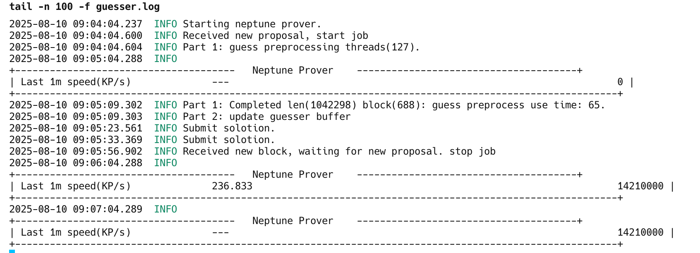

# **Neptune V2 CPU Guesser**  

# ⚠️ All miners must complete the upgrade V4.x.x by block height 15000。
# ⚠️ All miners must complete the upgrade V4.x.x by block height 15000。
# ⚠️ All miners must complete the upgrade V4.x.x by block height 15000。

**GPU ​Hardware Requirements**:​

- ​RAM: Minimum ​45GB​ (the software requires ​40GB​ to run).
- GPU: Nvidia
  
**Version >= 4.0.0**
| Parameter   | Resource Allocation | VRAM Requirement Description                                 |
| ----------- | ------------------- | ------------------------------------------------------------ |
| **`-m 0`**  | GPU-only            | Requires **over 40GB** of VRAM                               |
| **`-m 1`**  | GPU-only            | Requires **over 30GB** of VRAM                               |
| **`-m 2`**  | GPU-only            | Requires **over 22.5GB** of VRAM                             |
| **`-m 3`**  | GPU-only            | Requires **over 21.25GB** of VRAM                            |
| **`-m 42`** | Hybrid (GPU + CPU)  | Allocates approx. **3GB** of VRAM per instance. Should be used with the `-t N` by setting the number of concurrent instances `N`, ensuring that `3 * N`does not exceed total VRAM. **The default value is `N=3`**.|

**How to Verify Hardware Compatibility**

Check the log for the entry: ​​"guess preprocess use time"​.
If this time exceeds ​120 seconds, your hardware ​may not meet the requirements, and performance will be degraded.

---

## **📌 Mining Tutorial**  

### **1️⃣ Mining Pool Address**  
```bash
-p stratum+tcp://neptune.drpool.io:30127
```

### **2️⃣ Latest Miner Releases**  
🔗 **[Download Here](https://github.com/0xdrpool/neptune_v2_cpu_guesser/blob/main/download.md)**  

### **3️⃣ Mining Guide**  

#### **Basic Command**  
```bash
./dr_neptune_prover -p stratum+tcp://neptune.drpool.io:30127 -w drpoolaccount.xxx
```

### **4️⃣ Register a DRPool Account​**  

[drpool register](https://drpool.io/user/register)

### **5️⃣ USE GPU（Option）**

```bash
# -g
# Indexes of GPUs to use (starts from 0)
# Specify multiple times to use multiple GPUs
# Example: -g 0  -g 0,1,2,3

# -m
# GPU Memory: 0, 1, 2 (default: 42)
# 0: GPU with 40GB+ memory
# 1: GPU with 30GB+ memory
# 2: GPU with 23GB+ memory
# 3: GPU with 22GB+ memory
# 42: GPU + CPU，3G * N

# -t N It only works with the -m 42option.

./dr_neptune_prover -p stratum+tcp://neptune.drpool.io:30127 -w drpoolaccount.xxx -g 0,1,2,3 -m 2
```

---

### **⚙️ HiveOS**

**New Wallet**

Address input your drpool accountname


**Add New Flight Sheet**


**Setup Miner Config**

Extra config arguments:
- Miner name: `nptprover`
- Installation URL: `https://pub-e1b06c9c8c3f481d81fa9619f12d0674.r2.dev/image/v2/nptprover-4.0.0.tar.gz`
- Hash algorithm: `----`
- Wallet and worker template: `%WAL%.%WORKER_NAME%`
- Pool URL: `stratum+tcp://neptune.drpool.io:30127`
- Extra config arguments: 
  ```
  # -g
  # Indexes of GPUs to use (starts from 0)
  # Specify multiple times to use multiple GPUs
  # Example: -g 0  -g 0,1,2,3
  
  # -m
  # GPU Memory: 0, 1, 2 (default: 42)
  # 0: GPU with 40GB+ memory
  # 1: GPU with 30GB+ memory
  # 2: GPU with 23GB+ memory
  # 3: GPU with 22GB+ memory
  # 42: GPU + CPU，3G * N

  # -t N It only works with the -m 42option.
  ```


**View HiveOS logs**

`tail -f /root/hive/miners/custom/nptprover/nptprover.log -n 100`


### **⚙️ Setup on Ubuntu (v18.04+)**  

1. **Get a Mining Address**
   
   **Option 1**
   - Download **[Neptune-Core](https://github.com/Neptune-Crypto/neptune-core/releases/latest)**  
   - Generate a wallet:`neptune-cli generate-wallet`
   
   **Option 2**
   
   [vxb_neptune_wallet](https://github.com/VxBlocks/vxb_neptune_wallet)

1. **Download the Miner**  
   - Get the latest `ubuntu-dr_neptune_prover-x.x.x.tar.gz` from **[Download](https://github.com/0xdrpool/neptune_v2_cpu_guesser/blob/main/download.md)**
   ```bash
   # Ubuntu 18.04+
   wget https://pub-e1b06c9c8c3f481d81fa9619f12d0674.r2.dev/image/v2/ubuntu_20-dr_neptune_prover-4.0.0.tar.gz
   ```
     
3. **Extract & Prepare**  
   ```bash
   tar -zxvf ubuntu-dr_neptune_prover-x.x.x.tar.gz
   cd dr_neptune_prover && chmod +x inner_guesser.sh run_guesser.sh stop_guesser.sh dr_neptune_prover
   ```

4. **Configure Your Account**  
   - Edit `inner_guesser.sh` and update your **[drpool](https://drpool.io) account name**.  

5. **GPU Acceleration**
   - Edit `inner_guesser.sh` and update `./dr_neptune_prover --pool stratum+tcp://neptune.drpool.io:30127 --worker $accountname -g 0  -m 2`

7. **Start Mining**  
   ```bash
   ./start_guesser.sh
   ```
8. **View Mining Logs:**
   ```bash
   tail -n 100 -f guesser.log
   ```
   
   **Part1**
   1. ​Create the guesser_buffer for later guessing​
   2. The guesser_buffer generation took ​65 seconds.
   
   **Part2**
   
   Mined a valid nonce after proof generation

   **Last 1m speed(KP/s)**

   The proof generation speed per second in the last minute
  
9. **Stop Mining**
   ```bash
   ./stop_guesser.sh
   ```
   
